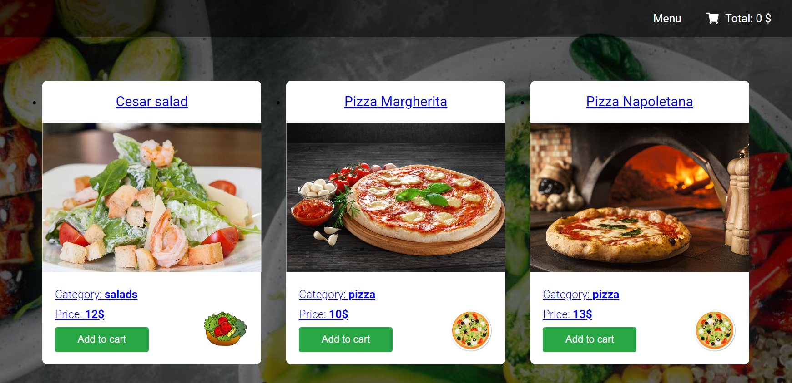

<div align="center">
	<br>
	<h1>Restro App</h1>
</div>

<!-- PROJECT SHIELDS -->
<div align="center">

   
   
   
   

</div>

<!-- ABOUT THE PROJECT -->
## About The Project



Restro App is a web application whose main purpose is to learn how to create a full-fledged website for ordering food.
When a user opens the app, it already has a static set of products. All products on the page are clickable. Users can
add products to the shopping cart and remove them from it. They can also make an order. 
Food data is stored on a local JSON server. In case of any changes by a user, the server reloads itself and the changes are automatically saved to a
local JSON file. <br> 
The front-end part was developed with JavaScript, React, Redux, HTML, and SCSS. The back-end part was developed with JSON and Fetch API.

## Built With

* [React](https://reactjs.org/)
* [HTML](https://developer.mozilla.org/en-US/docs/Web/HTML)
* [SCSS](https://sass-lang.com/)
* [JSON](https://www.json.org/json-en.html/)

<!-- GETTING STARTED -->
## Getting Started

### Prerequisites

* [Git](https://git-scm.com)
* [Node.js](https://nodejs.org/en/download/)
* [yarn](https://classic.yarnpkg.com/en/)

### Installation

```sh
# Step 1: Clone the repository
$ git clone https://github.com/RadyaBen/Restro-App.git

# Step 2: Go into the repository
$ cd Restro-App

# Step 3: Install all the dependencies
$ yarn install

# Step 4: Run the app
$ yarn start
```

<!-- LIVE DEMO -->
## Live Demo

Live demo URL: https://react-restro-app.herokuapp.com/

Note: the demo app is running on heroku free hosting, so server availability cannot be guaranteed.